<!-- hero: monochrome ASCII portrait (types in) beside a neofetch-style info
     panel. regenerate portrait: python scripts/prep_photo.py <photo> &&
     python scripts/make_ascii_svg.py ; info panel: python scripts/make_info_card.py -->

<!-- animated contribution graph: real data, boxes reveal cell by cell
     (regenerated daily by .github/workflows/update-profile-art.yml) -->

<h3><code>RafaelC0llares@github ~ $ ./contributions.sh</code></h3>

 
 

<h3><code>RafaelC0llaresgithub ~ $ whoami</code></h3>

<table>
<tr>
<!-- Nota: O arquivo mantém o nome avi-ascii.svg como estava na sua pasta local -->
<td valign="top"></td>
<td valign="top"></td>
</tr>
</table>

 
 

<h3><code>RafaelC0llares@github ~ $ ./links.sh</code></h3>

<b>Computer Engineering Student · Python Developer</b>

### 🎓 Academic & Professional

 

### 🔗 Links

 

